# Style Guide

## スタイルガイドの目的

> エンジニアがスタイルガイドを見ることによりアプリのデザインの統一されたコードが記載できること。

## Buttons

### 基本方針

* ユーザーがボタンをタップすることでアクションを実行することができます。
* ボタンはアクション可能であることや内包するアクション、ステータスを明示し、タップ後のインタラクションが想定できるようにします。
* ボタンは画面内の他のコンテンツと視覚的に差別化し、目立つように配置する必要があります。
* ボタンをタップしてるかどうかを見分けるため、ボタンタップ時は通常のボタンと色を分ける必要があります。
*  色や形、状態により用途を使い分けます。

### ボタンのある画面_サンプル

| 入力要素の送信                                                                                     | 選択肢の送信                                                                              |
| ------------------------------------------------------------------------------------------- | ----------------------------------------------------------------------------------- |
| 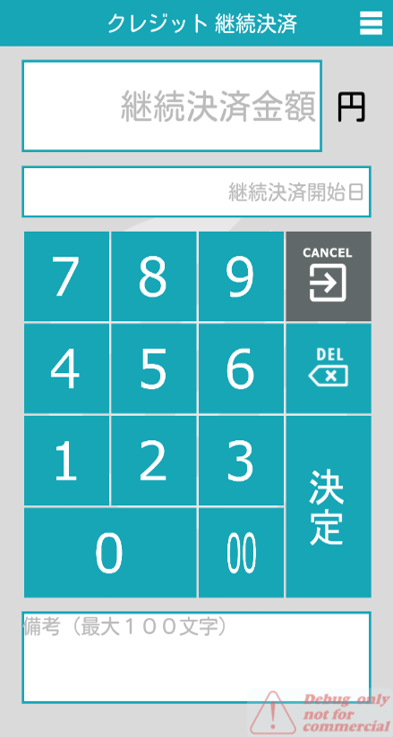 | 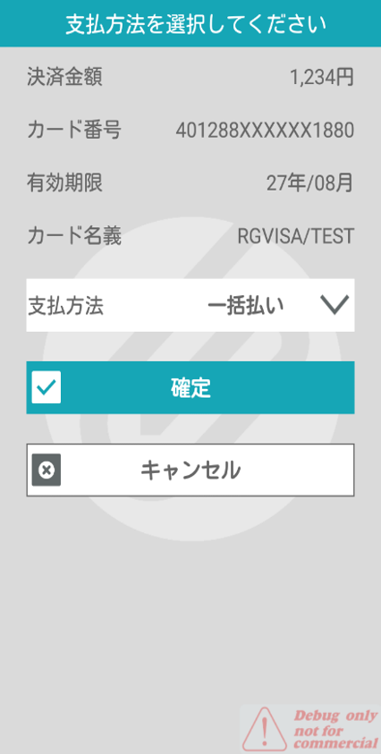 |

<!-- ### タイプ

状態によりいくつかの種類があり、用途によって使い分けをします。

- **color name : code** \[参照 : colors.xml] <br>
- **button** (= imageRsId) button of 時のもの <br>
- **text** : \[参照 strings.xml]<br>
- **button size** :  端末可変 -->

### 長方形ボタン

長方形型のボタンは、「確定」「キャンセル」のように決められた選択をするのに使用します。

ボタンの中にアイコンとテキストを含めて、一つのコンポーネントとして作成します。
色や状態によりいくつかの種類があり、用途によって使い分けをします。


#### 種類

| button                         |                                                                   | 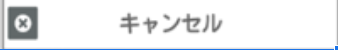                   | 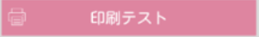                                                       |                              |
| ------------------------------ | ------------------------------------------------------------------------------------------------------------------- | ------------------------------------------------------------------------------------------------ | ---------------------------------------------------------------------------------------------------------------------------------- | ------------------------------------------------------------------------------------------------------------- |
| **usage**                      | [確定]選択のアクションに利用します                                                                                                  | [キャンセル]選択のアクションに利用します                                                                            | [印刷テスト]選択のアクションに利用します                                                                                                              | [完了]選択のアクションに利用します                                                                                            |
| **icon**                       |  |  |  |  |
| **icon name**                  | icon_check_green                                                                                                    | icon_cancel                                                                                      | option_printer                                                                                                                     | icon_check                                                                                                    |
| **color** <br>**(color code)** | paygate_green <br>(#16A6B6)                                                                                         | textfield_color_dark_gray <br>(#FF666666)                                                        | paygate_manage <br>(DE85A0)                                                                                                        | button_gray_middle <br>(#616869)                                                                              |


//メモ 
ボタン色
押下時
ナビゲーションバー
文字色
画面
設定画面以降はすべてピンクです
※例外は、
押下時も画像貼る
ON OFF を書く
dp値、カラーコード（#6, 8）記載で大丈夫
カラーコードは、

#### スペック

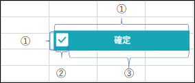

**① button**

幅：画面いっぱいのサイズにすること。(ex.`match_parent`)

高さ：`45dp`
<br>
※実際に使用する場合は、数値をハードコーディングするのではなく、下記のdimen.xmlのように変数名に置き換えること。

```java
// dimen.xml
<dimen name="button_height_default">45dp</dimen>
```

```
        android:layout_width="match_parent"
        android:layout_height="@dimen/button_height_default"
        android:layout_marginTop="@dimen/point_cash_payment_button_margin"
        pg:background="@drawable/button_green_middle"
        pg:mask_drawable="@drawable/button_green_middle_on"
```

② icon

ポジション：`left`

アイコン：ボタンの種類によって定められたアイコンを使用すること。
<br>
```
        pg:icon_pos="left"
        pg:icon="@drawable/icon_check_green"
```

③ text

ポジション：`center`

テキストカラー：白。
<br>※ただし、下地が白の場合は、グレーを使用すること。

```
        pg:text_bold="true"
        pg:text_color="@color/white"
        pg:text_pos="center"
        pg:text_value="@string/button_message_exist"
```

<br>

### 禁止事項

以下のようにアイコンやテキストのポジションの不要な変更は、ユーザーが混乱するため禁止します。

| NG                                                                        | 設定                                             |
| ------------------------------------------------------------------------- | ---------------------------------------------- |
|  | `pg:icon_pos="center"`<br>`pg:text_pos="left"` |

<br>

### 四角形ボタン
四角形型のボタンは、クレジット、銀聯のように「決済方法」ごとにボタンを使用します。
またメニューボタン押下時に表示される「決済取消」「決済履歴」「ポイント履歴」「設定」等にも使用します。

ボタンの中にアイコンとテキストを含めて、一つのコンポーネントとして作成します。
色や状態によりいくつかの種類があり、用途によって使い分けをします。


#### スペック

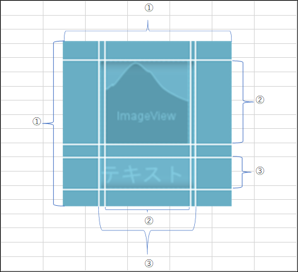

① **button**

高さ：端末可変(ex.`wrap_content`)

幅：端末可変(ex.`wrap_content`)

② **icon**

高さ：`50px`

幅：`50px`

③ **text**

高さ：端末可変(ex.`wrap_content`)

幅：端末可変(ex.`wrap_content`)

スタイル：`bold`

#### 種類

| button                               | 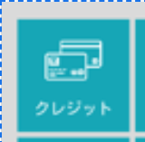                                                                                            | 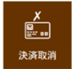                                                                          |                                                                                      |                                                                                      | 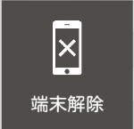                                                                                       |
| ------------------------------------ | ----------------------------------------------------------------------------------------------------------------------------------------------------------------------- | --------------------------------------------------------------------------------------------------------------------------------------------------------------------- | -------------------------------------------------------------------------------------------------------------------------------------------------------------------------- | ------------------------------------------------------------------------------------------------------------------------------------------------------------------- | ------------------------------------------------------------------------------------------------------------------------------------------------------------------------ |
| **usage**                            | [決済方法]選択のアクションに利用します                                                                                                                                                    | [取消]選択のアクションに利用します                                                                                                                                                    | [履歴]選択のアクションに利用します                                                                                                                                                         | [設定]選択のアクションに利用します                                                                                                                                                  | [端末解除]選択のアクションに利用します                                                                                                                                                     |
| **icon** <br> **/icon size**         | 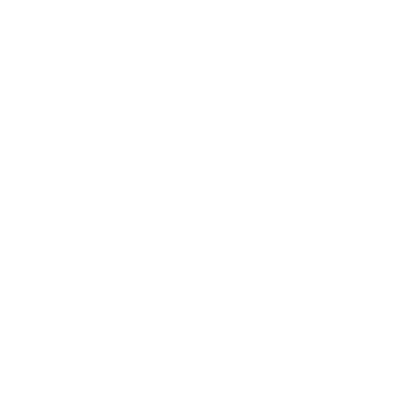 <br>`layout_width="50dp"`<br>`layout_height="50dp"` |  <br>`layout_width="50dp"`<br>`layout_height="50dp"` |  <br>`layout_width="50dp"`<br>`layout_height="50dp"` |  <br>`layout_width="50dp"`<br>`layout_height="50dp"` |  <br>`layout_width="50dp"`<br>`layout_height="50dp"` |
| **icon name**                        | `R.drawable.launch_credit`                                                                                                                                              | `R.drawable.menu_cancel`                                                                                                                                              | `R.drawable.menu_log_payment`                                                                                                                                              | `R.drawable.icon_menu_setting`                                                                                                                                      | `R.drawable.option_release`                                                                                                                                              |
| **text** <br>**(stringRsId)**        | クレジット　<br>(`R.id.str_function_setting_credit`)                                                                                                                          | 決済取消　<br>(`R.id.str_menu_cancel`)                                                                                                                                     | 決済履歴　<br>(`R.id.str_menu_history`)                                                                                                                                         | 設定　<br>(`R.id.str_menu_setting`)                                                                                                                                    | 端末解除　<br>(`R.id.str_function_unregister_device`)                                                                                                                         |
| **text color**                       | white                                                                                                                                                                   | white                                                                                                                                                                 | white                                                                                                                                                                      | white                                                                                                                                                               | white                                                                                                                                                                    |
| **color name** <br> **(color code)** | paygate_green <br>(`#16A6B6`)                                                                                                                                           | textfield_color_dark_gray <br>(`#FF666666`)                                                                                                                           | button_blue_dark <br>(`#172e50`)                                                                                                                                           | paygate_manage <br>(`DE85A0`)                                                                                                                                       | button_black <br>(`#4e4d4a`)                                                                                                                                             |
| **size**                             | 端末可変                                                                                                                                                                    | 端末可変                                                                                                                                                                  | 端末可変                                                                                                                                                                       | 端末可変                                                                                                                                                                | 端末可変                                                                                                                                                                     |

### スイッチボタン
スイッチ型のボタンは、主に メニュー > 設定 > オプションメニュー内で使用されます。
ボタンのON OFF により設定の使用可、不可を見分けるために用います。

| button    |  | 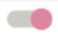 |
| --------- | -------------------------------------------------------------------------------- | ------------------------------------------------------------------------------- |
| **usage** | 設定をOFFの状態にします                                                                    | 設定をONの状態にします                                                                    |

---

<!--
ダイアログサイズは、deviceによって可変である
例）
    final int dialogWidth = (int) (metrics.widthPixels * 0.9);
    final int dialogHeight = (int) (metrics.heightPixels * 0.4);
 -->

# Header

## 基本方針

画面のタイトルやアクションアイテム、ナビゲーションアイテムを表示します。

画面上に表示されるコンテンツの内容やこれから行うアクションの目的を簡潔にわかりやすく表示します。

表示されている画面の階層を明らかにし、簡単に上位階層の画面へ移動できるようにします。

## サンプル

**regular header**


## スペック

**ex) option menu**

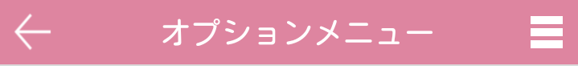

| button　         |                                                                                                                                                                                                      |  | 　      |                                                                                                                                                                                                                                    |                                                 |         |
| --------------- | ---------------------------------------------------------------------------------------------------------------------------------------------------------------------------------------------------------------------------------------------------------------------------------- | ------------------------------------------------------------------------------ | ------ | ---------------------------------------------------------------------------------------------------------------------------------------------------------------------------------------------------------------------------------- | ----------------------------------------------- | ------- |
| **button spec** | `android:layout_width="@dimen/menu_title_icon_size"` <br> `android:layout_height="@dimen/menu_title_icon_size"` <br>`android:background="?android:attr/selectableItemBackgroundBorderless"` <br> `android:padding="@dimen/margin_m"` <br> `android:layout_gravity="center_vertical | left"`<br>`android:gravity="center_vertical                                    | left"` | `android:layout_width="40dp"` <br>`android:layout_height="40dp"` <br>`android:background="?android:attr/selectableItemBackgroundBorderless"` <br>`android:padding="@dimen/margin_l"` <br> `android:layout_gravity="center_vertical | right"`  <br> `android:gravity="center_vertical | right"` |
| **usage**       | タップすると前回の画面へ遷移します                                                                                                                                                                                                                                                                  | タップするとメニューを表示します　                                                              |        |                                                                                                                                                                                                                                    |                                                 |         |

| icon          |              |          |
| ------------- | ---------------------------------------------------------------------------------------------------- | ---------------------------------------------------------------------------------------------------- |
| **icon spec** | `android:layout_width="30dp"`<br>`android:layout_height="30dp"`<br>`android:layout_gravity="center"` | `android:layout_width="30dp"`<br>`android:layout_height="30dp"`<br>`android:layout_gravity="center"` |
| **usage**     | [戻る]ボタンで利用されます                                                                                       | [メニュー]ボタンで利用されます                                                                                     |

| background color |  |
| ---------------- | ------------------------------------------------------------------------------------------ |
| **color name**   | paygate_manage                                                                             |
| **color code**   | DE85A0                                                                                     |

| text     | 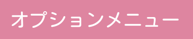                                |
| -------- | ------------------------------------------------------------------------------------------------------------------------ |
| **spec** | `android:layout_width="wrap_content"` <br> `android:layout_height="wrap_content"` <br>`android:textColor="@color/white"` |

| Column A | Column B | Column C |
| -------- | -------- | -------- |
| A1       | B1       | C1       |
| A2       | B2       | C2       |
| A3       | B3       | C3       |

---

## Color

### 基本方針

色は、アプリの中でユーザーに情報を伝える直感的な方法です。
操作可能な要素の強調、ユーザー操作に対するフィードバックの提供、インターフェイスの連続感の演出を色によって行うことができます。

基本的にStation アプリ内では、色によってボタンやヘッダーの種類を区別します。

### ブランドカラー

ブランドカラーはPaygate Station アプリのブランドそのものを表すカラーであり、ロゴに利用されるカラーです。
また「メニュー」「キャンセル(取消)」以外の基本的な正のアクションをする際に使用します。

カラーコードは`#16A6B6`を用います。

| **image**                       |  |   |
| ------------------------------- | ------------------------------------------------------------------------- | - |
| **brand name**                  | Paygate Green                                                             |   |
| **color name <br>(color code)** | paygate_green <br>(#16A6B6)                                               |   |

### 種類

| **image**      |  |  |  |  |  |
| -------------- | ----------------------------------------------------------------------------------------- | ------------------------------------------------------------------------------------------- | ------------------------------------------------------------------------------------------ | --------------------------------------------------------------------------------------- | ---------------------------------------------------------------------------------------- |
| **color name** | paygate_green                                                                             | main_background                                                                             | paygate_manage, switch_pointer_color_on                                                    | button_blue                                                                             | button_brown                                                                             |
| **color code** | #16A6B6                                                                                   | #dadada                                                                                     | #DE85A0                                                                                    | #295598                                                                                 | #663300                                                                                  |
| **usage**      | 決済などのアクションに利用します                                                                          | 背景などの設定に利用します                                                                               | 設定などのアクションに利用します                                                                           | 履歴のアクションに利用します                                                                          | メニューの決済取消ボタンに利用します                                                                       |

### 禁止事項

基本的に背景にアクセントカラーの設定はハーレーションを起こすなど、<br>ユーザーに不快感を与える可能性があるため禁止します。

| NG                                                                                        | OK                                                                                     |
| ----------------------------------------------------------------------------------------- | -------------------------------------------------------------------------------------- |
|  |  |

---

## Dialog

### 基本方針

ユーザーの操作を一時中断させ、アクションを促す、またはエラーなどのお知らせを表示する際に使用します。
ダイアログはあくまで副次的な情報を表示するものであり、ダイアログ上に主コンテンツを表示することは推奨しません。

ダイアログ上には、表示された理由、ユーザーがとるべきアクションをわかりやすく表示します。
<br>
※ダイアログサイズは端末可変です。

### 水平ダイアログ

優先順位や機能が同等の情報を表示する場合は、アクションボタンを横並びに最大2つまで配置することを許容とします。<br>3つ以上の選択肢を設ける場合は、ボタンを縦に並べる、または他のUIにしてください。

| **dialog**        | 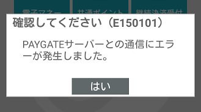 | 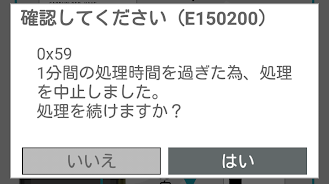 | 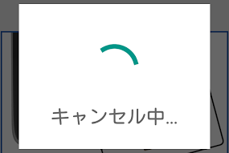 |
| ----------------- | ------------------------------------------------------ | -------------------------------------------------------- | ----------------------------------------------------------- |
| **dialog button** | 1                                                      | 2                                                        | None                                                        |

### 種類

| **dialog** |  |  |  |
| ---------- | ------------------------------------------------------ | -------------------------------------------------------- | ----------------------------------------------------------- |
| **name**   | Alert                                                  | Alert2                                                   | Progress                                                    |
| **usage**  | エラー内容などを表示します                                          | アクションの選択を表示します                                           | ローディング中であることを表示します                                          |

| **dialog** | 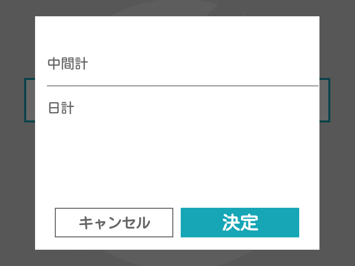 |  | 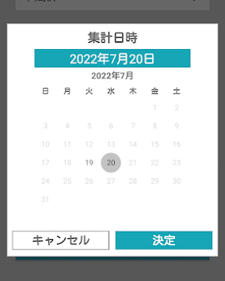 |
| ---------- | ----------------------------------------------------------------------------- | ---------------------------------------------------------------- | ------------------------------------------------------------- |
| **name**   | Confirmation                                                                  | Confirmation2                                                    | Date picker                                                   |
| **usage**  | アクションの選択を表示します                                                                | アクションの選択を表示します                                                   | 日付の選択を表示します                                                   |

| **dialog** | 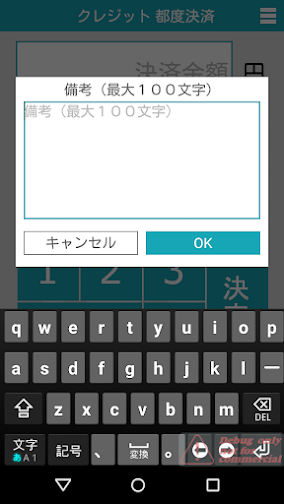 | 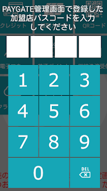 | 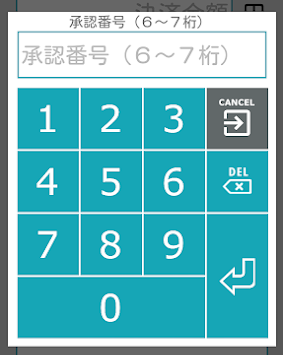 |
| ---------- | --------------------------------------------------------- | ----------------------------------------------------------- | -------------------------------------------------------- |
| **name**   | Prompt                                                    | Pass code                                                   | Input                                                    |
| **usage**  | テキストの入力を表示します                                             | パスコードの入力を表示します                                              | 数値の入力を表示します                                              |

---

## Font

### 基本方針

定義されたFont Familyを利用し、すべての画面において一貫性を保ちます。

視認性/可読性を担保し、どんな人が見ても内容を理解できるようにレイアウトする必要があります。

## フォントサイズ

フォントサイズはdimens.xmlにて定義されています。

各画面やコンポーネントごとに適したフォントサイズを使用します。

サイズ単位 : `dp`, `sp`
<br>
`dp` : デバイスのdpiに対して相対的に変化します。
<br>
`sp` : デバイスのフォントサイズ設定によって相対的に変化します。

## サンプル

| 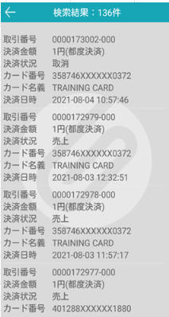 |
| --------------------------------------------------------------------------- |
| ex ) 取引番号                                                                   |
| `textSize="18sp"`                                                           |
| `textColor="@color/textfield_color_dark_gray"`                              |

## フォントサイズ種類

- **name** \[参照 : dimens.xml]
- **text color** \[default : secondary_text_material_light]
- **font family** \[default : sans-serif]
- **no8** \[textColorHint : @color/textfield_color_hint]

| **no** | **name**                            | **size** | **sample**                                                                     | **text color**                | **font familey** |   |                           |            |
| ------ | ----------------------------------- | -------- | ------------------------------------------------------------------------------ | ----------------------------- | ---------------- | - | ------------------------- | ---------- |
| 1      | paygate_air_font_size_2xs           | 8sp      | 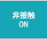            | white                         | MONOSPACE        |   |                           |            |
| 2      | paygate_air_font_size_xs            | 10sp     | -                                                                              | -                             | -                |   |                           |            |
| 3      | paygate_air_font_size_s             | 12sp     | 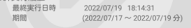              | secondary_text_material_light | sans-serif       |   |                           |            |
| 4      | paygate_air_font_size_m             | 14sp     | 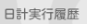              | secondary_text_material_light | sans-serif       |   |                           |            |
| 5      | paygate_air_font_size_l             | 18sp     |               | white                         | sans-serif       |   |                           |            |
| 6      | paygate_air_font_size_ll            | 20sp     |              | white                         | sans-serif       |   |                           |            |
| 7      | paygate_air_font_size_3l            | 22sp     | 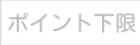             | secondary_text_material_light | sans-serif       |   |                           |            |
| 8      | paygate_air_font_size_4l            | 24sp     | -                                                                              | -                             | -                | - | textfiled_color_dark_gray | sans-serif |
| 9      | paygate_air_font_size_xl            | 26sp     |              | textfield_color_dark_gray     | sans-serif       |   |                           |            |
| 10     | paygate_air_font_size_3xl           | 32sp     |             | textfiled_color_dark_gray     | sans-serif       |   |                           |            |
| 11     | paygate_air_font_size_4xl           | 64sp     |             | secondary_text_material_light | sans-serif       |   |                           |            |
|        |                                     |          |                                                                                |                               |                  |   |                           |            |
| 12     | menu_item_font_size                 | 10sp     | -                                                                              | -                             | -                |   |                           |            |
| 13     | menu_sub_item_font_size             | 8sp      | -                                                                              | -                             | -                |   |                           |            |
|        |                                     |          |                                                                                |                               |                  |   |                           |            |
| 14     | launch_button_text_size             | 14sp     |        | white                         | sans-serif       |   |                           |            |
|        |                                     |          |                                                                                |                               |                  |   |                           |            |
| 15     | input_payment_money_font_size       | 45sp     | 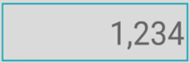  | textfield_color_dark_gray     | sans-serif       |   |                           |            |
| 16     | input_payment_number_font_size      | 34sp     | 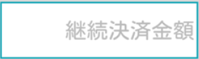 | textfiled_color_dark_gray     | sans-serif       |   |                           |            |
|        |                                     |          |                                                                                |                               |                  |   |                           |            |
| 17     | input_rakuten_card_number_text_size | 30sp     | 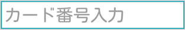 | secondary_text_material_light | sans-serif       |   |                           |            |

---

# Icon

## 基本方針

アイコンを利用することで、コンテンツの直感的な理解を促します。<br>アイコンは単体でも機能する必要があります。テキストを利用しなくても一目で意味が理解できるものである必要があります。<br>無駄な装飾は排除し、シンプルかつフレンドリーな設計である必要があります。

| **Image**                                                                                                    | **Size**                                        | **color** |
| ------------------------------------------------------------------------------------------------------------ | ----------------------------------------------- | --------- |
|  | `layout_width="50dp"`<br>`layout_height="50dp"` | `#FFFFFF` |

## Usage

| icon      |  |  |  |  |  |
| --------- | ------------------------------------------------------------------------------------------------------------ | ---------------------------------------------------------------------------------------------------------- | --------------------------------------------------------------------------------------------------------------- | -------------------------------------------------------------------------------------------------------- | ------------------------------------------------------------------------------------------------------------- |
| icon name | `R.drawable.launch_credit`                                                                                   | `R.drawable.menu_cancel`                                                                                   | `R.drawable.menu_log_payment`                                                                                   | `R.drawable.icon_menu_setting`                                                                           | `R.drawable.option_release`                                                                                   |
| usage     | [クレジット]の場合に使用                                                                                                | [決済取消]の場合に使用                                                                                               | [決済履歴]の場合に使用                                                                                                    | [設定]の場合に使用                                                                                               | [端末解除]の場合に使用                                                                                                  |

#### Emoney

| icon          |  |  |  | 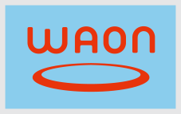 |  | 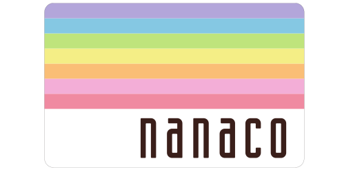 |
| ------------- | ------------------------------------------------------------------------------------------------------------------- | ------------------------------------------------------------------------------------------------------------------- | -------------------------------------------------------------------------------------------------------------------- | --------------------------------------------------------------------------------------------------------------------- | -------------------------------------------------------------------------------------------------------------------- | ----------------------------------------------------------------------------------------------------------------------- |
| **icon name** | `R.drawable.icon_image_sf`                                                                                          | `R.drawable.icon_image_id`                                                                                          | `R.drawable.icon_image_edy`                                                                                          | `R.drawable.icon_image_waon`                                                                                          | `R.drawable.icon_image_qpp`                                                                                          | `R.drawable.icon_image_nanaco`                                                                                          |
| **usage**     | [交通系]の場合に使用                                                                                                         | [iD]の場合に使用                                                                                                          | [Edy]の場合に使用                                                                                                          | [WAON]の場合に使用                                                                                                          | [QuickPay]の場合に使用                                                                                                     | [nanaco]の場合に使用                                                                                                          |

## 禁止事項

- 自社・他社ブランドを侵犯する表現や、Paygateのロゴを変形・変色してイラストに使用することはできません
- 公序良俗に反する表現
- 線画や水彩風など、ガイドラインに沿わない表現

ex) 

<style>
img.center {
  display: block; margin: auto;
}

img.border {
  border: 1px solid;
}

img.border-radius {
  border: 1px solid;
  border-radius: 8px;
}

img.background-color {
  background: gray;
}

img.size-auto {
  height: auto;
  width: auto
}

img.size-s {
  height: 300px;
  width: auto;
}
</style>
